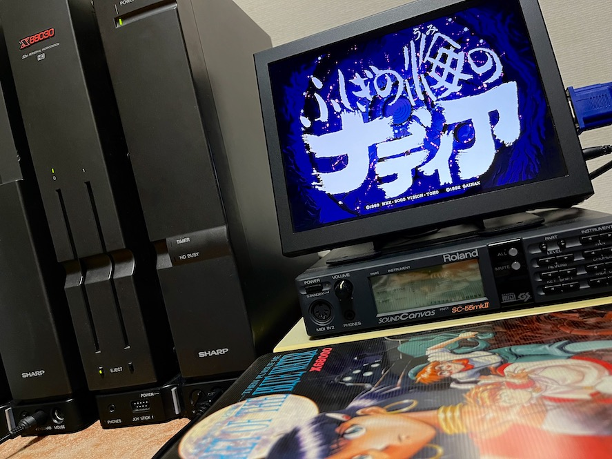

# nadia-x68k
X68000版 ふしぎの海のナディアに関する覚書

---

## はじめに

この覚書はX68000用ゲームソフトの一つである、ふしぎの海のナディア (GAINAX) に関するメモです。

以下について記述しています。

* ハードディスクインストールと起動
* X68000XVI+PhantomXでの動作
* X68030+060turboでの動作

060turbo実機での動作例

---

## ハードディスクインストールと起動

本ソフトは標準でハードディスクインストールに対応しています。

ただし、空きメモリの確認に独特な方法が使われているため、デバイスドライバや常駐プログラムを沢山入れていると、説明書で指定された通りに起動しようとしても「メモリが不足しています」のメッセージが表示され起動できないことがあります。

なお、この状態になった場合はインタラプトボタンで抜けることができます。

これを回避するためには、AUTOEXEC.BATの中でも組み込めるドライバはCONFIG.SYSではなくそちらで組み込むようにして、ゲーム起動前に常駐解除するのがおすすめです。

特にメモリを食うのはフォントドライバやディスクキャッシュなどです。HIOCSでフォントを変えたい場合などは、CONFIG.SYSの中ではHIOCS本体の組み込みに留め、AUTOEXEC.BATの中で改めて HIOCS /Fでフォントを組み込むなどすることで回避可能です。

---

## X68000XVI+PhantomXでの動作

元々X68000対応でHuman68k v2.0で動作するソフトですが、前述したメモリの条件さえ満たせば 68040モード + Human68k v3.02でも動作します。(ただし最後まで確認したわけではありません)

---

## X68030+060turboでの動作

060turbo.sysをCONFIG.SYSで組み込むと、どうしてもメモリの条件を満たすことができないので、060turbo.sysをあえて組み込まないか、起動用のFDを作るなどすれば 68060モード + Human68k v3.02 でも動きます。(ただし最後まで確認したわけではありません)

---

## 更新履歴

2023.09.20 ... 初版
