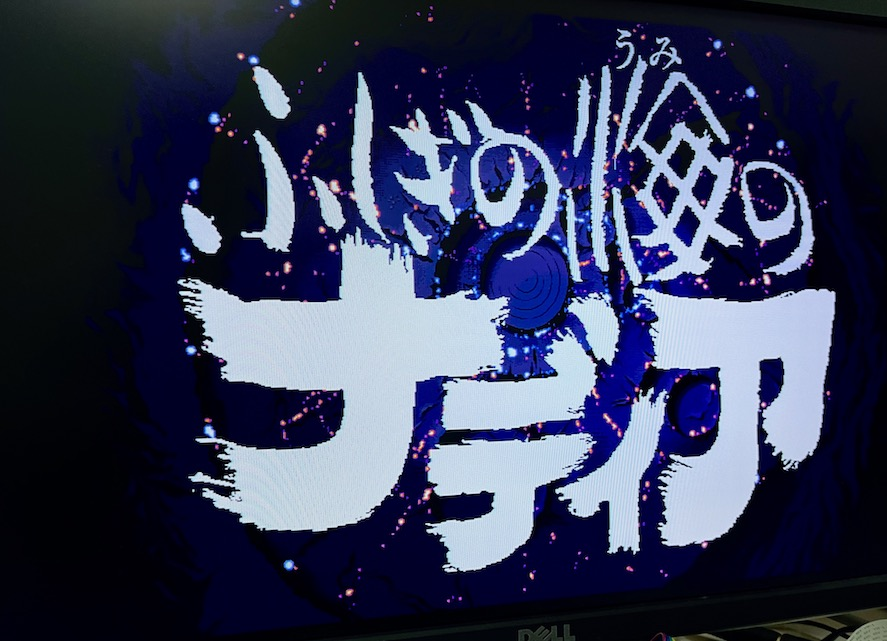

# nadia-x68k
X68000版 ふしぎの海のナディアに関する覚書

---

## はじめに

この覚書はX68000用ゲームソフトの一つである、ふしぎの海のナディア (GAINAX) に関するメモです。

以下について記述しています。

* ハードディスクインストールと起動
* X68030での動作
* PhantomXでの動作

---

## ハードディスクインストールと起動

本ソフトは標準でハードディスクインストールに対応しています。

ただし、空きメモリの確認に独特な方法が使われているため、デバイスドライバや常駐プログラムを沢山入れていると、メモリ12MBフル実装の状態であっても、起動時に「メモリが不足しています」のメッセージが表示され起動できないことがあります。

なお、この状態になった場合はインタラプトボタンで抜けることができます。

これを回避するためには、AUTOEXEC.BATの中でも組み込めるドライバはCONFIG.SYSではなくそちらで組み込むようにして、ゲーム起動前に常駐解除するのがおすすめです。

具体的には起動プログラムがロードされる番地が特定のアドレス内に収まっている必要があります。`process.x` を実行して、`process.x` 自身の開始アドレスが 0x08???? 番地までであればほぼ大丈夫です。

特にメモリを食うのはBUFFERSの設定、ディスクキャッシュ、フォントドライバなどです。例えばHIOCSでフォントを変えたい場合などは、CONFIG.SYSの中ではHIOCS本体の組み込みだけに留め、AUTOEXEC.BATの中で改めて HIOCS /F でフォントを組み込むなどすることで後からフォントデータ常駐部分だけ切り離すことができます。

---

## X68030での動作

起動FDはHuman68k v2なのでそこからは起動できません。そのためHDDインストーラの起動もできませんが、単純にすべてのディスクの内容を特定のディレクトリにコピーするだけでokです。重複しているファイルは無視して大丈夫です。

この方法でHDDインストールし、上記のメモリの条件さえ満たせば Human68k 3.02 でもHDD起動することができます。もしメモリ条件を満たすことが厳しい場合はHuman68k 3.02の起動FDを作り、CONFIG.SYSを最低限の物にしてHDD上の起動プログラムを動かす設定にしても大丈夫です。

---

## PhantomXでの動作

元々X68000対応でHuman68k v2.0で動作するソフトですが、前述したメモリの条件さえ満たせば 68030モード + Human68k v3.02でもHDD起動で動作しています。(ただし最後まで確認したわけではありません)

---

## 更新履歴

2023.09.21 ... 初版
